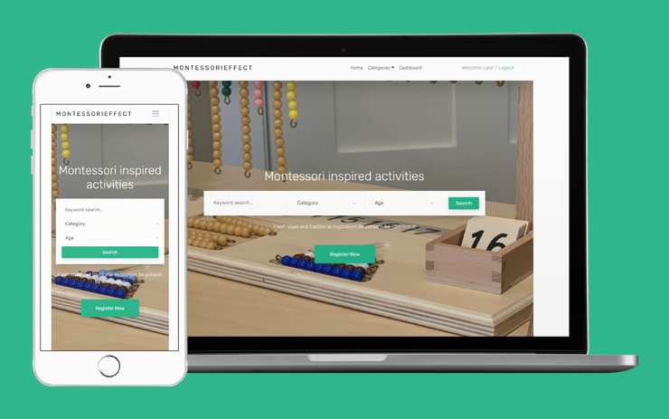

# Montessorieffect

 
An education platform that enable users who homeschool children find free Montessori resources. There is an admin dashboard where the activities can be created, and the user can use the website to search these activities by entering a keyword or using some filters. The user can get more details/instructions and also be able to download printable materials.

To create this project, I've combined my two passions Montessori Education and Developing! I've developed this full-stack website from scratch designing the backend with a Django framework and Python and writing a user friendly frontend with HTML and CSS.

Features: 

P0 - Must Have
- Landing Page (Home) - Static, 
- Activities Page: 
    ○ Loads all activities into boxes, reads data from database 
    ○ Show activities by url parameters 
- Activity details page mywebsite/activities/id: 
    ○ loads one activity details 
- Login /Registration 
- Admin- list of all activities 
- Admin- add activity - 
    ○ With title, category, age range and textbox. 
    ○ Upload a file (jpg) 
- Admin-edit activity, Admin-delete activity 
- Search on landing page (Home)- by keyword, category and/or by age
		
	
	
	
P1 - Nice to have
- Logged in user can write comments for an activity, Shows user comments 
- Admin- add activity - 
    - With an html textbox.
- Newsletter -mailchimp
- Admin upload pdf
- User download printables as pdf
- About and Contact pages

